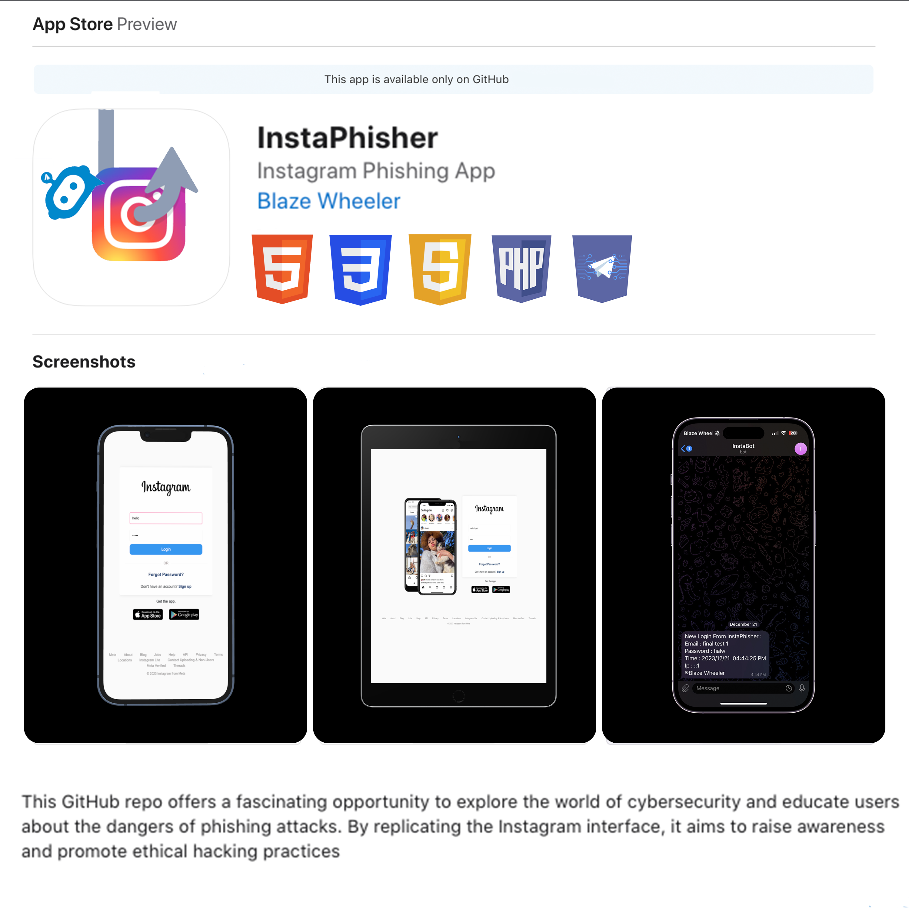

<a name="readme-top"></a>

<!-- PROJECT SHIELDS -->
[![Apple-Silicon-Shield]][Apple-Silicon-Shield-url]
[![MIT License][license-shield]][license-url]


[![LinkedIn][linkedin-shield]][linkedin-url]
[![GitHub][GitHub-shield]][GitHub-url]

<!-- PROJECT LOGO -->
<br />
<div align="center">
  <a href="">
    
  </a>

  <h3 align="center">InstaPhisher</h3>

  <p align="center">
    A Ethical Hacking Phishing Tool
    <br />
    </div>

<!-- ABOUT THE PROJECT -->
## About The Project

Instagram phishing clone website, created solely for legal purposes. This GitHub repo offers a fascinating opportunity to explore the world of cybersecurity and educate users about the dangers of phishing attacks. By replicating the Instagram interface and sending login credentials to a telegram bot, it aims to raise awareness and promote ethical hacking practices.



<p align="right">(<a href="#readme-top">back to top</a>)</p>

### App Demo


<p align="right">(<a href="#readme-top">back to top</a>)</p>

### Built With 

* [![HTML-badge][HTML-badge]][HTML-url]
* [![CSS-badge][CSS-badge]][CSS-url]
* [![Javascript-badge][Javascript-badge]][Javascript-url]
* [![PHP-badge][PHP-badge]][PHP-url]
* [![Telegram-badge][Telegram-badge]][Telegram-url]


<p align="right">(<a href="#readme-top">back to top</a>)</p>

<!-- GETTING STARTED -->
## Getting Started / Installation

Getting started is fairly simple...

### Prerequisites

* Download repository 

* Create Telegram Bot - [Documentation](https://core.telegram.org/bots/api) 

* Open
  ```sh
  send.php
  ```

* Enter Telegram Credentials
  ```sh
 	// Setting 
	$apiToken = "******";
	$YOUR_ID_TELE = "********";
  ```

* Format Your ouptut
  ```sh
 	// Setting 
	$apiToken = "******";
	$YOUR_ID_TELE = "********";
  ```

* Open Terminal
  ```sh
  php -S localhost:8000
  ```
* Build & Run


<!-- LICENSE -->

# Released Under MIT License

Copyright (c) 2022 Blaze Wheeler,

Permission is hereby granted, free of charge, to any person
obtaining a copy of this software and associated documentation
files (the "Software"), to deal in the Software without
restriction, including without limitation the rights to use,
copy, modify, merge, publish, distribute, sublicense, and/or sell
copies of the Software, and to permit persons to whom the
Software is furnished to do so, subject to the following
conditions:

The above copyright notice and this permission notice shall be
included in all copies or substantial portions of the Software.

THE SOFTWARE IS PROVIDED "AS IS", WITHOUT WARRANTY OF ANY KIND,
EXPRESS OR IMPLIED, INCLUDING BUT NOT LIMITED TO THE WARRANTIES
OF MERCHANTABILITY, FITNESS FOR A PARTICULAR PURPOSE AND
NONINFRINGEMENT. IN NO EVENT SHALL THE AUTHORS OR COPYRIGHT
HOLDERS BE LIABLE FOR ANY CLAIM, DAMAGES OR OTHER LIABILITY,
WHETHER IN AN ACTION OF CONTRACT, TORT OR OTHERWISE, ARISING
FROM, OUT OF OR IN CONNECTION WITH THE SOFTWARE OR THE USE OR
OTHER DEALINGS IN THE SOFTWARE.
<p align="right">(<a href="#readme-top">back to top</a>)</p>


<!-- CONTACT -->
## Contact

Blaze Wheeler - [@blazew](https://www.instagram.com/blazew/) - wheelerb2@duq.edu

<p align="right">(<a href="#readme-top">back to top</a>)</p>

<!-- MARKDOWN LINKS & IMAGES -->

[Apple-Silicon-Shield]: https://img.shields.io/badge/Apple-Silicon_M2-999999?style=for-the-badge&logo=apple&logoColor=white
[Apple-Silicon-Shield-url]: https://support.apple.com/en-us/HT211814

[license-shield]: https://img.shields.io/github/license/othneildrew/Best-README-Template.svg?style=for-the-badge
[license-url]: https://www.mit.edu/~amini/LICENSE.md
[linkedin-shield]: https://img.shields.io/badge/-LinkedIn-black.svg?style=for-the-badge&logo=linkedin&colorB=555

[linkedin-url]:https://www.linkedin.com/in/blaze-wheeler-8306a2223/
[GitHub-shield]: 	https://img.shields.io/badge/GitHub-100000?style=for-the-badge&logo=github&logoColor=white
[GitHub-url]: https://github.com/blazeWheeler
[product-screenshot]: images/screenshot.png

[HTML-url]: https://www.w3schools.com/howto/howto_make_a_website.asp
[HTML-badge]: https://img.shields.io/badge/HTML5-E34F26.svg?style=for-the-badge&logo=HTML5&logoColor=white
[CSS-url]: https://www.w3schools.com/css/
[CSS-badge]: https://img.shields.io/badge/CSS3-1572B6.svg?style=for-the-badge&logo=CSS3&logoColor=white

[Javascript-url]: https://www.w3schools.com/js/
[JavaScript-badge]: https://img.shields.io/badge/JavaScript-F7DF1E.svg?style=for-the-badge&logo=JavaScript&logoColor=black

[PHP-url]: https://www.php.net/docs.php
[PHP-badge]: https://img.shields.io/badge/PHP-777BB4.svg?style=for-the-badge&logo=PHP&logoColor=white

[Telegram-url]: https://core.telegram.org/bots/api
[Telegram-badge]: https://img.shields.io/badge/Telegram%20API-26A5E4.svg?style=for-the-badge&logo=Telegram&logoColor=white

[Duq-url]: https://duq.edu
[Duq-badge]:(https://custom-icon-badges.demolab.com/badge/-Duquesne%20University-ba0c2f?style=for-the-badge&logo=duquesne_dukes_logo1)